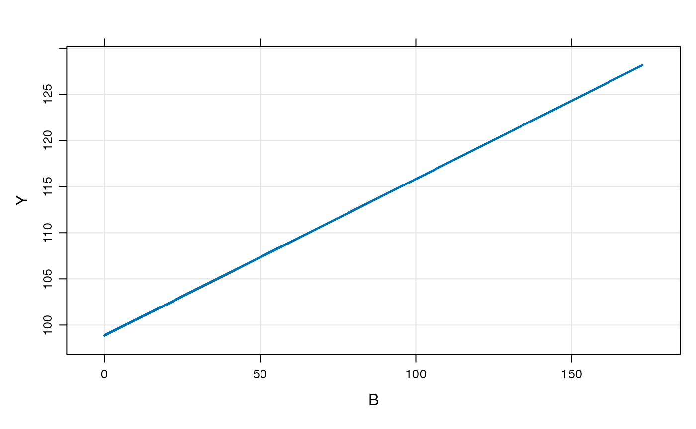
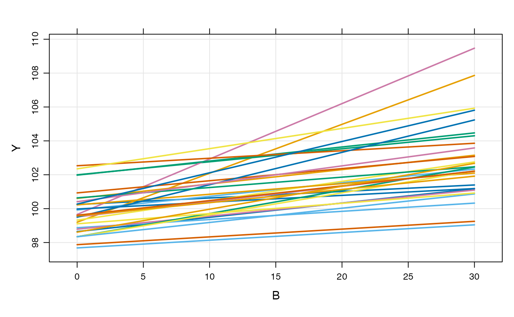
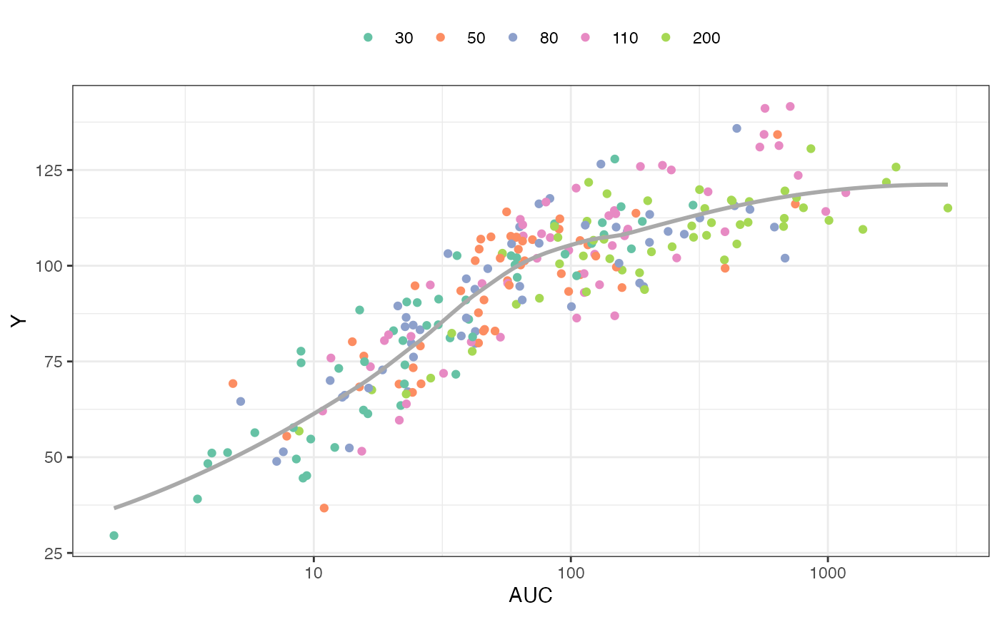

# Models without compartments

``` r

library(mrgsolve)
library(ggplot2)
library(dplyr)
library(purrr)
```

This vignette introduces a new formal code block for writing models
where there are no compartments. The block is named after the analogous
NONMEM block called `$PRED`. This functionality has always been possible
with mrgsolve, but only now is there a code block dedicated to these
models. Also, a relaxed set of data set constraints have been put in
place when these types of models are invoked.

## Example model

As a most-basic model, we look at the `pred1` model in
[`modlib()`](https://mrgsolve.org/docs/reference/modlib.md)

``` r

mod <- modlib("pred1")
```

The model code is

``` c
$PROB
An example model expressed in closed form
$PARAM B = -1, beta0 = 100, beta1 = 0.1
$OMEGA 2 0.3
$PRED
double beta0i = beta0 + ETA(1);
double beta1i = beta1*exp(ETA(2));
capture Y = beta0i + beta1i*B;
```

This is a random-intercept, random slope linear model. Like other models
in mrgsolve, you can write parameters (`$PARAM`), and random effects
(`$OMEGA`). But the model is actually written in `$PRED`.

When mrgsolve finds `$PRED`, it will generate an error if it also finds
`$MAIN`, `$TABLE`, or `$ODE`. However, the code that gets entered into
`$PRED` would function exactly as if you put it in `$TABLE`.

In the example model, the response is a function of the parameter `B`,
so we’ll generate an input data set with some values of `B`

``` r

data <- tibble(ID = 1, B = exp(rnorm(100, 0,2)))

head(data)
```

    ## # A tibble: 6 × 2
    ##      ID     B
    ##   <dbl> <dbl>
    ## 1     1 5.61 
    ## 2     1 0.749
    ## 3     1 0.322
    ## 4     1 0.150
    ## 5     1 2.06 
    ## 6     1 4.06

``` r

out <- mrgsim_d(mod, data, carry_out = "B")

plot(out, Y~B)
```



Like other models, we can simulate from a population

``` r

df <- map_df(1:30, ~ tibble(ID = .x, B = seq(0,30,1)))

head(df)
```

    ## # A tibble: 6 × 2
    ##      ID     B
    ##   <int> <dbl>
    ## 1     1     0
    ## 2     1     1
    ## 3     1     2
    ## 4     1     3
    ## 5     1     4
    ## 6     1     5

``` r

mod %>% 
  data_set(df) %>% 
  mrgsim(carry_out = "B") %>%
  plot(Y ~ B)
```



## PK/PD Model

Here is an implementation of a PK/PD model using `$PRED`

In this model

- Calculate `CL` as a function of `WT` and a random effect
- Derive `AUC` from `CL` and `DOSE`
- The response (`Y`) is a calculated from `AUC` and the Emax model
  parameters

``` r

code <- '
$PARAM TVCL = 1, WT = 70, AUC50 = 20, DOSE = 100, E0 = 35, EMAX = 2.4

$OMEGA 1

$SIGMA 100

$PRED
double CL = TVCL*pow(WT/70,0.75)*exp(ETA(1));
capture AUC = DOSE/CL;
capture Y = E0*(1+EMAX*AUC/(AUC50+AUC))+EPS(1);
'
```

``` r

mod <- mcode_cache("pkpd", code)
```

To simulate, look at 50 subjects at each of 5 doses

``` r

set.seed(8765)

data <- 
  expand.idata(DOSE = c(30,50,80,110,200), ID = 1:50) %>% 
  mutate(WT = exp(rnorm(n(),log(80),1)))

head(data)
```

    ##   ID DOSE        WT
    ## 1  1   30  39.67626
    ## 2  2   50  36.27156
    ## 3  3   80  60.14424
    ## 4  4  110  81.59561
    ## 5  5  200  22.10396
    ## 6  6   30 126.69565

``` r

out <- mrgsim_df(mod, data, carry_out="WT,DOSE") 

head(out)
```

    ##   ID time        WT DOSE       AUC         Y
    ## 1  1    0  39.67626   30 298.76467 115.82635
    ## 2  2    0  36.27156   50 108.78989  97.65895
    ## 3  3    0  60.14424   80  13.74925  52.41350
    ## 4  4    0  81.59561  110 186.47672 125.92038
    ## 5  5    0  22.10396  200 494.49076 116.76226
    ## 6  6    0 126.69565   30  22.61341  74.10551

Plot the response (`Y`) versus `AUC`, colored by dose

``` r

ggplot(out, aes(AUC, Y, col =factor(DOSE))) + 
  geom_point() + 
  scale_x_log10(breaks = 10^seq(-4, 4)) + 
  geom_smooth(aes(AUC,Y), se = FALSE, col="darkgrey") + theme_bw() + 
  scale_color_brewer(palette = "Set2", name = "") + 
  theme(legend.position = "top")
```


