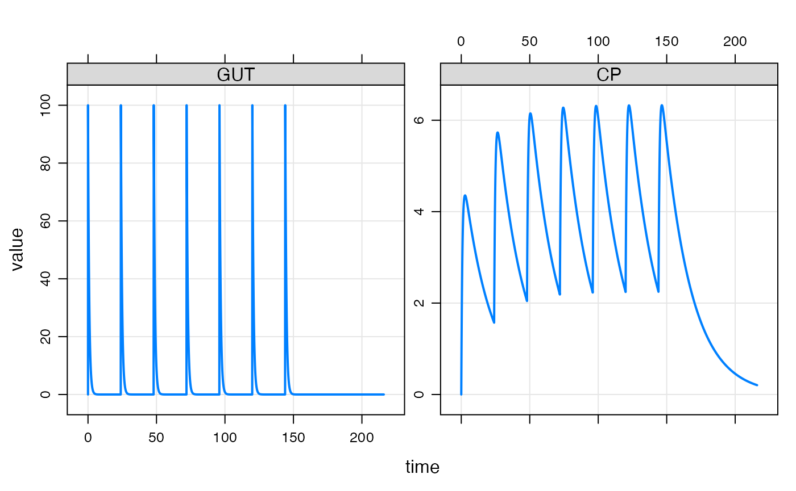
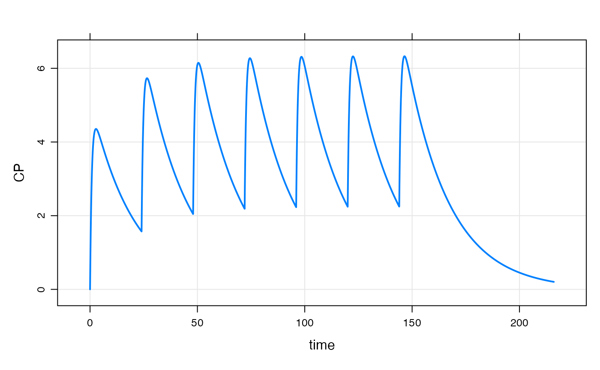
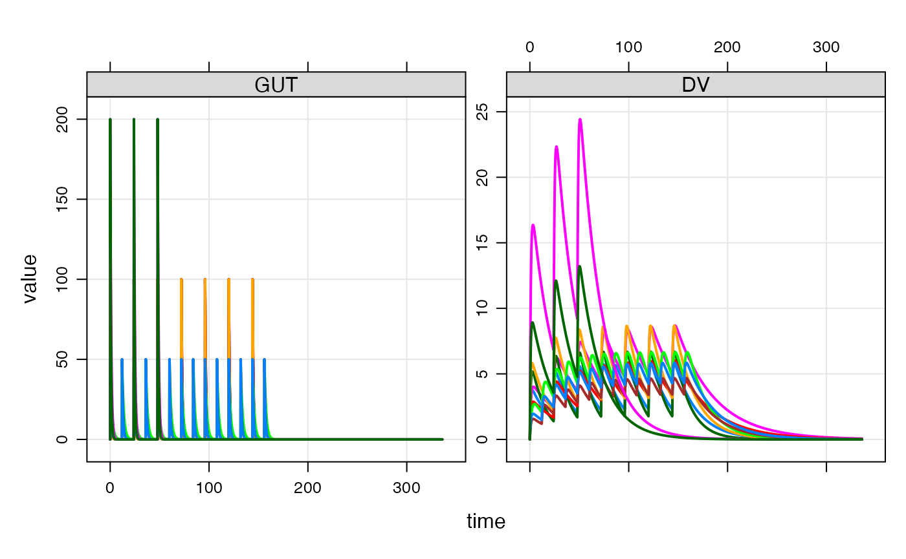

# Event objects

``` r

library(mrgsolve)
library(dplyr)
```

## Introduction

Event objects are simple ways to implement PK dosing events into your
model simulation.

Let’s illustrate event objects with a one-compartment, PK model. We read
this model from the `mrgsolve` internal model library.

``` r

mod <- house(end = 216, delta = 0.1)
```

## Events

Events are constructed with the
[`ev()`](https://mrgsolve.org/docs/reference/ev.md) function

``` r

e <- ev(amt = 100, ii = 24, addl = 6)
```

This will implement 100 unit doses every 24 hours for a total of 7
doses. `e` has class `ev`, but really it is just a data frame

``` r

e
```

    ## Events:
    ##   time amt ii addl cmt evid
    ## 1    0 100 24    6   1    1

``` r

as.data.frame(e)
```

    ##   time amt ii addl cmt evid
    ## 1    0 100 24    6   1    1

We can implement this series of doses by passing `e` in as the `events`
argument to `mrgsim`

``` r

mod %>% mrgsim(events = e) %>% plot(GUT + CP ~ time)
```



The events can also be implemented with the `ev` constructor along the
simulation pipeline

``` r

mod %>%
  ev(amt = 100, ii = 24, addl = 6) %>%
  mrgsim %>% 
  plot(CP ~ time)
```



### Event defaults and expectations

1.  `amt` is required
2.  `evid = 0` is forbidden
3.  Default `time` is 0
4.  Default `evid` is 1
5.  Default `cmt` is 1

Also by default, `rate`, `ss` and `ii` are 0.

## Combine events

`mrgsolve` has operators defined that allow you to combine events. Let’s
first define some event objects.

``` r

e1 <- ev(amt = 500)
e2 <- ev(amt = 250, ii = 24, addl = 4)
e3 <- ev(amt = 500, ii = 24, addl = 0)
e4 <- ev(amt = 250, ii = 24, addl = 4, time = 24)
```

We can combine `e1` and `e3` with a collection operator

``` r

c(e1, e4)
```

    ## Events:
    ##   time amt cmt evid ii addl
    ## 1    0 500   1    1  0    0
    ## 2   24 250   1    1 24    4

`mrgsolve` also defines a [`seq()`](https://rdrr.io/r/base/seq.html)
method that lets you execute one event and then a second event

``` r

seq(e3, e2)
```

    ## Events:
    ##   time amt ii addl cmt evid
    ## 1    0 500 24    0   1    1
    ## 2   24 250 24    4   1    1

Notice that `e3` has both `ii` and `addl` defined. This is required for
`mrgsolve` to know when to start `e2`.

### Combine to create a data set

We can take several event objects and combine them into a single
simulation data frame with the `as_data_set` function.

``` r

e1 <- ev(amt = 100, ii = 24, addl = 6,  ID = 1:5)
e2 <- ev(amt = 50,  ii = 12, addl = 13, ID = 1:3)
e3 <- ev(amt = 200, ii = 24, addl = 2,  ID = 1:2)
```

When combined into a data set, we get \* N=5 IDs receiving 100 mg Q24h
x7 \* N=3 IDs receiving 50 mg Q12h x 14 \* N=2 IDs receiving 200 mg Q48h
x 3

``` r

data <- as_data_set(e1, e2, e3)

data
```

    ##    ID time amt ii addl cmt evid
    ## 1   1    0 100 24    6   1    1
    ## 2   2    0 100 24    6   1    1
    ## 3   3    0 100 24    6   1    1
    ## 4   4    0 100 24    6   1    1
    ## 5   5    0 100 24    6   1    1
    ## 6   6    0  50 12   13   1    1
    ## 7   7    0  50 12   13   1    1
    ## 8   8    0  50 12   13   1    1
    ## 9   9    0 200 24    2   1    1
    ## 10 10    0 200 24    2   1    1

To simulate from this data set, we use the `data_set` function. First,
let’s add an OMEGA matrix to this model:

``` r

mod <- omat(mod, as_dmat(c(0.1, 0.1, 0.1, 0.1)))
```

``` r

mod %>% data_set(data) %>% mrgsim(end=336) %>% plot("GUT, DV")
```


