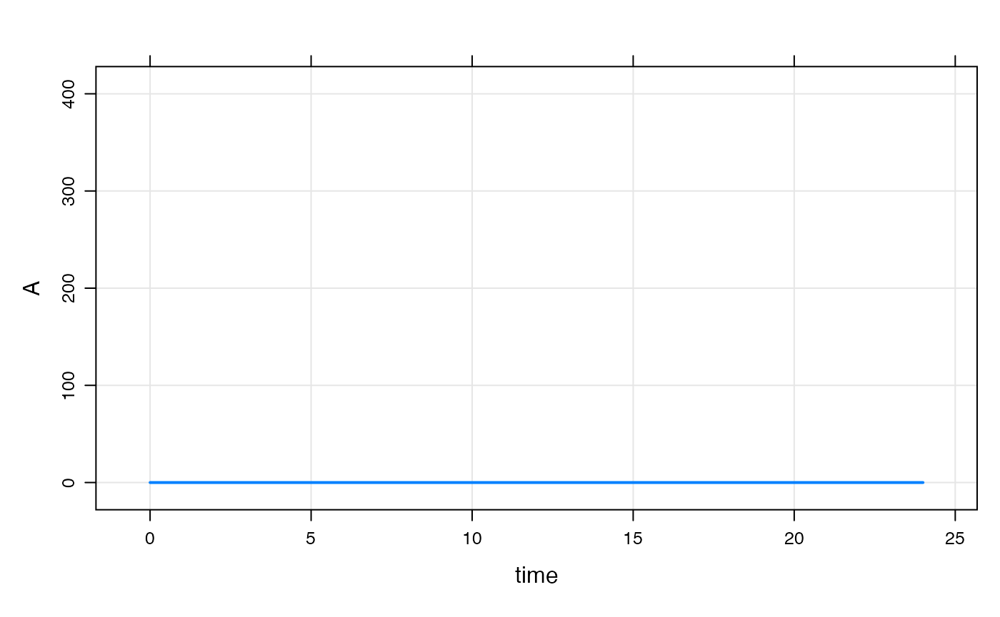
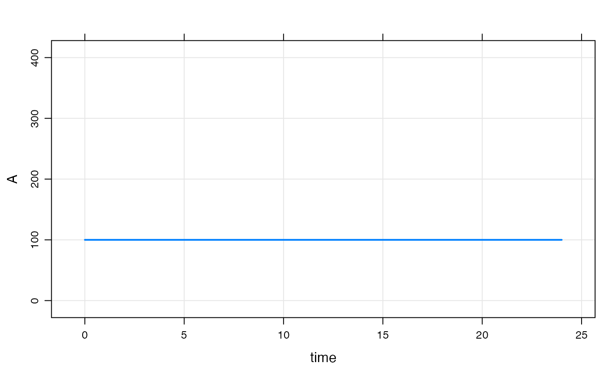
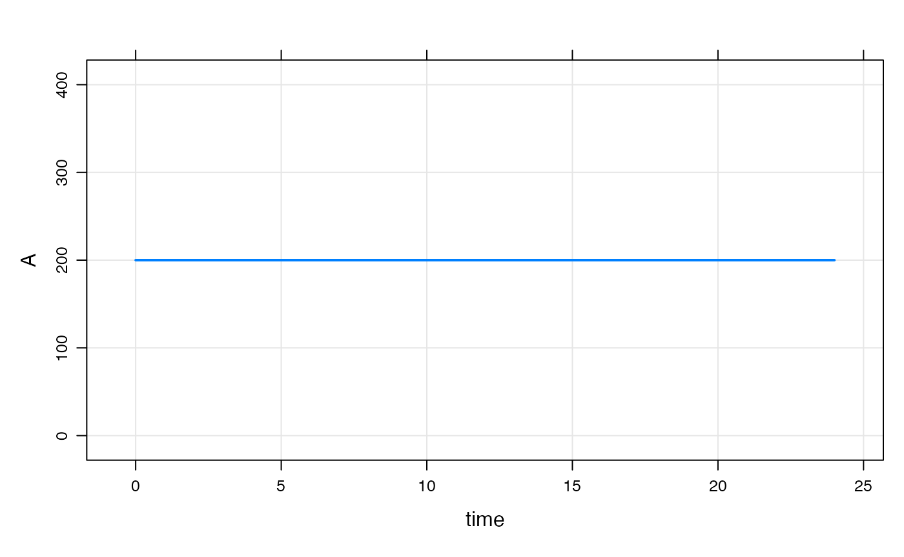
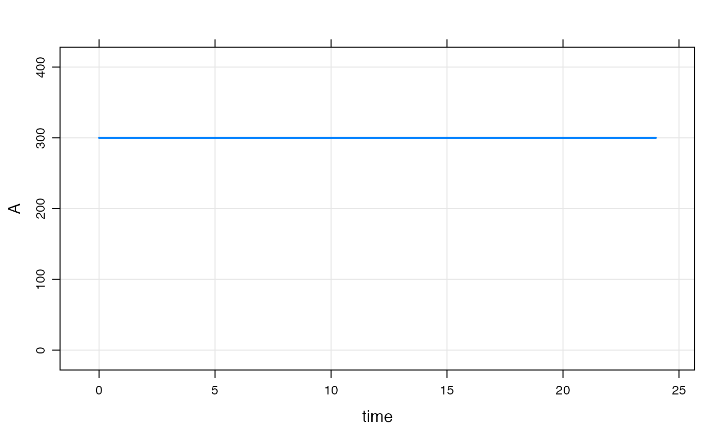
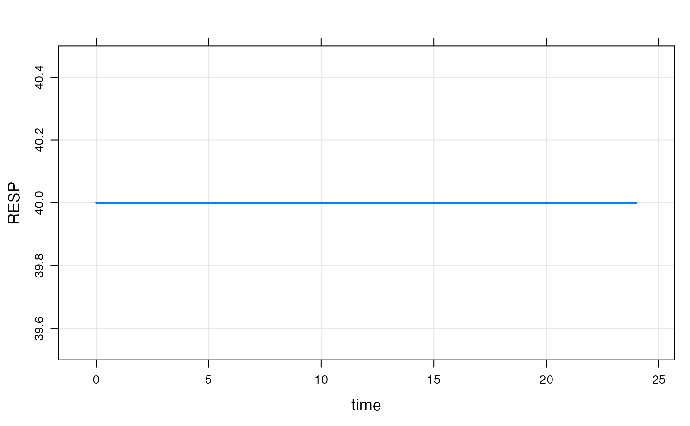
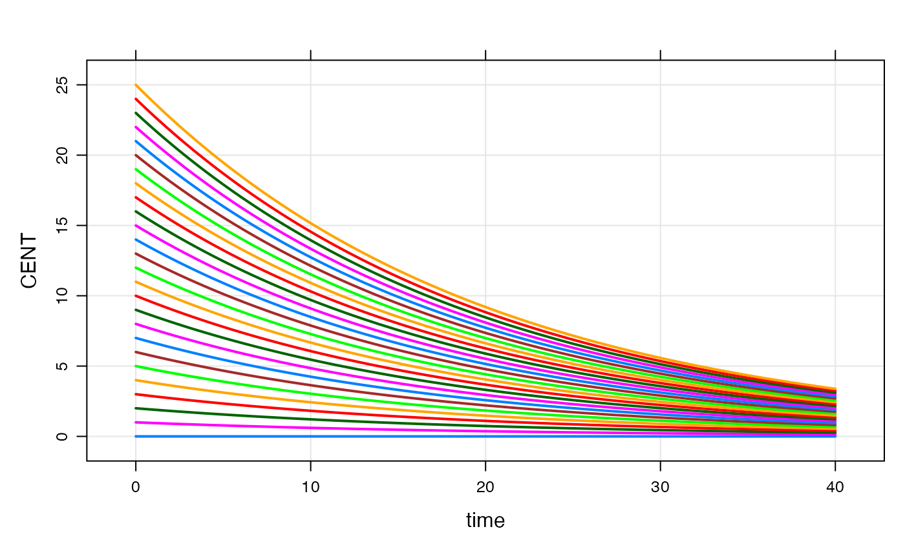

# Set initial conditions

## Short answer

There are two commonly-used ways to set initial conditions: in `$MAIN`
and in the initial condition list.

### Set initials in `$MAIN`

For a compartment called `CMT`, there is a variable available to you
called `CMT_0` that you can use to set the initial condition of that
compartment in `$MAIN`. For example:

``` r

code <- '
$PARAM KIN = 200, KOUT = 50

$CMT RESP

$MAIN
RESP_0 = KIN/KOUT;
'
```

This is the most commonly-used way to set initial conditions: the
initial condition for the `RESP` compartment is set equal to `KIN`
divided by `KOUT`. If you had a parameter called `BASE`, you could also
write `RESP_0 = BASE;`. In these examples, we’re using data items from
`$PARAM`. But the initial condition could be set to any numeric value in
the model, including individual parameters derived from parameters,
covariates, and random effects. Note that you should never declare
`RESP_0` (e.g. `double RESP_0`): it just appears for you to use.

### Set initials in the `init` list

You can also set initial conditions in the initials list. Most commonly,
this means declaring compartments with `$INIT` rather than `$CMT`. For
example

``` r

code <- '
$INIT RESP = 4
'
```

This method gets us the same result as the previous example, however the
initial condition now is not a derived value, but it is coded as a
number. Alternatively, you could declare a compartment via `$CMT` and
update later (see next).

We can update this value later like this

``` r

library(mrgsolve) 

mod <- mcode("init_up", code)

init(mod)
```

    ## 
    ##  Model initial conditions (N=1):
    ##  name       value . name    value
    ##  RESP (1)   4     | . ...   .

``` r

init(mod, RESP=8) %>% init
```

    ## 
    ##  Model initial conditions (N=1):
    ##  name       value . name    value
    ##  RESP (1)   8     | . ...   .

This method is commonly used to set initial conditions in large QSP
models where the compartment starts out as some known or assumed steady
state value.

### Don’t use initial conditions as a dosing mechanism

Using an initial condition to put a starting dose in a compartment is
not recommended. Always use a dosing event for that.

## Long answer

The following is from a wiki post I did on the topic. It’s pedantic. But
hopefully helpful to learn what `mrgsolve` is doing for those who want
to know.

- `mrgsolve` keeps a base list of compartments and initial conditions
  that you can update **either** from `R` or from inside the model
  specification
  - When you use `$CMT`, the value in that base list is assumed to be 0
    for every compartment
  - `mrgsolve` will by default use the values in that base list when
    starting the problem
  - When only the base list is available, every individual will get the
    same initial condition
- You can **override** this base list by including code in `$MAIN` to
  set the initial condition
  - Most often, you do this so that the initial is calculated as a
    function of a parameter
  - For example, `$MAIN RESP_0 = KIN/KOUT;` when `KIN` and `KOUT` have
    some value in `$PARAM`
  - This code in `$MAIN` overwrites the value in the base list for the
    current `ID`
- For typical PK/PD type models, we most frequently initialize in
  `$MAIN`
  - This is equivalent to what you might do in your NONMEM model
- For larger systems models, we often just set the initial value via the
  base list

### Make a model only to examine `init` behavior

Note: `IFLAG` is my invention only for this demo. The demo is always
responsible for setting and interpreting the value (it is not reserved
in any way and `mrgsolve` does not control the value).

For this demo

- Compartment `A` initial condition defaults to 0
- Compartment `A` initial condition will get set to `BASE` **only** if
  `IFLAG > 0`
- Compartment `A` always stays at the initial condition (the system
  doesn’t advance)

``` r

code <- '
$PARAM BASE=200, IFLAG = 0

$CMT A

$MAIN
if(IFLAG > 0) A_0 = BASE;

$ODE dxdt_A = 0;
'
```

``` r

mod <- mcode("init_long",code)
dplot <- function(x) plot(x,ylim=c(0,400))
```

**Check the initial condition**

``` r

init(mod)
```

    ## 
    ##  Model initial conditions (N=1):
    ##  name    value . name    value
    ##  A (1)   0     | . ...   .

Note:

- We used `$CMT` in the model spec; that implies that the base initial
  condition for `A` is set to 0
- In this chunk, the code in `$MAIN` doesn’t get run because `IFLAG` is
  0
- So, if we don’t update something in `$MAIN` the initial condition is
  as we set it in the base list

``` r

mod %>% mrgsim %>% dplot
```



**Next, we update the base initial condition for `A` to 100**

Note:

- The code in `$MAIN` still doesn’t get run because `IFLAG` is 0

``` r

mod %>% init(A = 100) %>% mrgsim %>% dplot
```



**Now, turn on `IFLAG`**

Note:

- Now, that code in `$MAIN` gets run
- `A_0` is set to the value of `BASE`

``` r

mod %>% param(IFLAG=1) %>% mrgsim %>% dplot
```



``` r

mod %>% param(IFLAG=1, BASE=300) %>% mrgsim %>% dplot
```



### Example PK/PD model with initial condition

Just to be clear, there is no need to set any sort of flag to set the
initial condition.

``` r

code <- '
$PARAM AUC=0, AUC50 = 75, KIN=200, KOUT=5

$CMT RESP

$MAIN 
RESP_0 = KIN/KOUT;

$ODE
dxdt_RESP = KIN*(1-AUC/(AUC50+AUC)) - KOUT*RESP;
'
```

``` r

mod <- mcode("init_long2", code)
```

The initial condition is set to 40 per the values of `KIN` and `KOUT`

``` r

mod %>% mrgsim %>% plot
```



Even when we change `RESP_0` in `R`, the calculation in `$MAIN` gets the
final say

``` r

mod %>% init(RESP=1E9) %>% mrgsim
```

    ## Model:  init_long2 
    ## Dim:    25 x 3 
    ## Time:   0 to 24 
    ## ID:     1 
    ##     ID time RESP
    ## 1:   1    0   40
    ## 2:   1    1   40
    ## 3:   1    2   40
    ## 4:   1    3   40
    ## 5:   1    4   40
    ## 6:   1    5   40
    ## 7:   1    6   40
    ## 8:   1    7   40

### Calling `init` will let you check to see what is going on

- It’s a good idea to get in the habit of doing this when things aren’t
  clear
- `init` first takes the base initial condition list, then calls `$MAIN`
  and does any calculation you have in there; so the result is the
  calculated initials

``` r

init(mod)
```

    ## 
    ##  Model initial conditions (N=1):
    ##  name       value . name    value
    ##  RESP (1)   40    | . ...   .

``` r

mod %>% param(KIN=100) %>% init
```

    ## 
    ##  Model initial conditions (N=1):
    ##  name       value . name    value
    ##  RESP (1)   20    | . ...   .

## Set initial conditions via `idata`

Go back to house model

``` r

mod <- mrgsolve:::house()
init(mod)
```

    ## 
    ##  Model initial conditions (N=3):
    ##  name       value . name       value
    ##  CENT (2)   0     | RESP (3)   50   
    ##  GUT (1)    0     | . ...      .

Notes

- In `idata` (only), include a column with `CMT_0` (like you’d do in
  `$MAIN`).
- When each ID is simulated, the `idata` value will override the base
  initial list for that subject.\
- But note that if `CMT_0` is set in `$MAIN`, that will override the
  `idata` update.

``` r

idata <- expand.idata(CENT_0 = seq(0,25,1))

idata %>% head
```

    ##   ID CENT_0
    ## 1  1      0
    ## 2  2      1
    ## 3  3      2
    ## 4  4      3
    ## 5  5      4
    ## 6  6      5

``` r

out <- 
  mod %>% 
  idata_set(idata) %>% 
  mrgsim(end=40)
```

``` r

plot(out, CENT~.)
```


