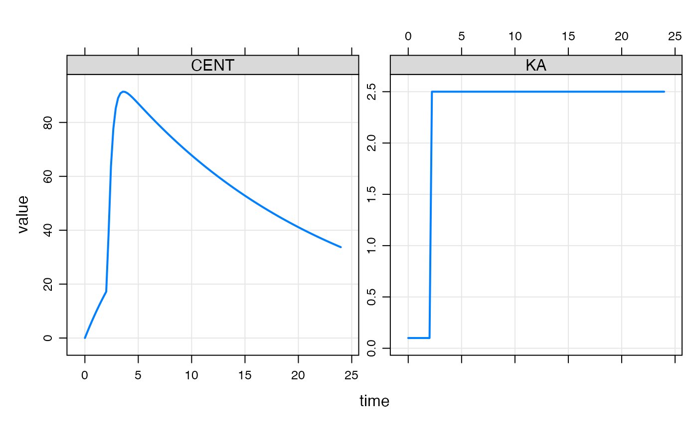
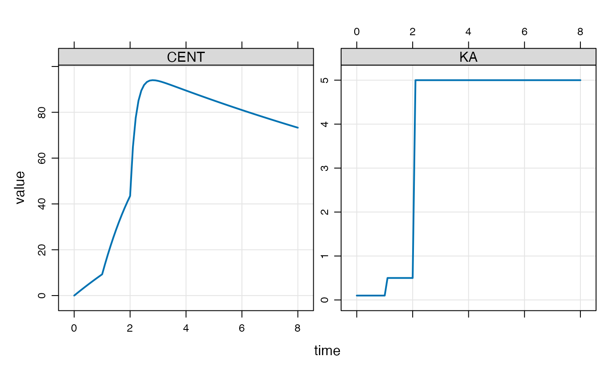

# Modeled events

## Introduction

A modeled event is a discontinuity introduced into the simulation at a
time and with characteristics that are determined within the model
itself, rather than the standard setup of specifying these events via
the data set.

In this vignette, we’ll focus on creating a discontinuity in the
simulation so that the value of a parameter can change at a specific
time that is not necessarily chosen prior to the run time.

## Example with single mtime

For example, we might wish a rate constant to change at some time that
is not found in a record in the input data set. We can make this happen
from the model code itself using `mtime()`.

Let’s make KA change at 2.1 hours (`change_t` parameter in the example
below).

``` r
[ param ]
CL = 1, V = 20, KA1 = 0.1, KA2 = 2.5, change_t = 2.1

[ pkmodel ] 
cmt = "GUT,CENT", depot = TRUE

[ main ] 
double mt = self.mtime(change_t);

capture KA = KA1;

if(TIME > mt) KA = KA2;

if(TIME == change_t) {
  mrg::report("wait a minute ... time is 2.1?");  
}
```

Again, the main motivation for this is just convenience and economy of
code: we register the event time and get that time returned into a
variable that we can reference later on, checking if we are past that
time or not.

``` r

library(mrgsolve)
library(dplyr)

mod <- mread_cache("mtime-model.txt")

mod %>% ev(amt=100) %>% mrgsim(delta = 0.222) %>% plot(CENT+KA~time)
```



You won’t see the message that we actually stumbled on `2.1` hours in
the simulation even though it was not in the lineup when the simulation
started.

## Example with several mtimes

We could keep track of several mtimes like this

``` r
[ set ] end=8, delta=0.1

[ param ]
CL = 1, V = 20, KA1 = 0.1, KA2 = 0.5, KA3 = 5, change_t = 1

[ pkmodel ] 
cmt = "GUT,CENT", depot = TRUE

[ main ] 
double mt = self.mtime(change_t);

double mt2 = self.mtime(change_t + 1);

capture KA = KA1;

if(TIME > mt) KA = KA2;

if(TIME > mt2) KA = KA3;
```

``` r

mod <- mread_cache("mtime-model-2.txt")

mod %>% ev(amt=100) %>% mrgsim() %>% plot(CENT + KA ~ time)
```


