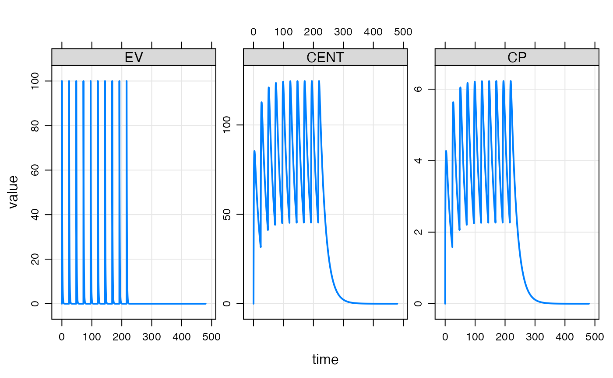

# Get started

This is a simple vignette to help you get your first simulation done
with mrgsolve. Check out
<https://github.com/metrumresearchgroup/mrgsolve> for links to other
resources including the user guide, blog, vignettes, pkgdown
documentation and more.

## Load a model

After loading the package

``` r

library(dplyr)
library(mrgsolve)
```

we’ll use the
[`modlib()`](https://mrgsolve.org/docs/reference/modlib.md) function to
read, parse, compile and load a model out of the internal model library.
These models are good to try when learning mrgsolve.

For this first example, we’re using a one compartment model (called
`pk1` in the model library)

``` r

mod <- modlib("pk1")
```

Once we create the model object (`mod`) we can extract certain
information about the model. For example, get an overview

``` r

mod
```

    . 
    . 
    . -----------------  source: pk1.cpp  -----------------
    . 
    .   project: /private/var/fol...gsolve/models
    .   shared object: pk1-so-79c64bf0980 
    . 
    .   time:          start: 0 end: 24 delta: 1
    .                  add: <none>
    .   compartments:  EV CENT [2]
    .   parameters:    CL V KA [3]
    .   captures:      CP [1]
    .   omega:         0x0 
    .   sigma:         0x0 
    . 
    .   solver:        rtol: 1e-08 atol: 1e-08 itol: 1 (scalar)
    . ------------------------------------------------------

Or look at model parameters and their values

``` r

param(mod)
```

    . 
    .  Model parameters (N=3):
    .  name value . name value
    .  CL   1     | V    20   
    .  KA   1     | .    .

We’ll see in the section below how to run a simulation from this model.
But first, let’s create a dosing intervention to use with this model.

## Create an intervention

The simplest way to create an intervention is to use an event object.
This is just a simple expression of one or more model interventions
(most frequently doses)

``` r

evnt <- ev(amt = 100, ii = 24, addl = 9)
```

``` r

evnt
```

    . Events:
    .   time amt ii addl cmt evid
    . 1    0 100 24    9   1    1

We’ll see in other vignettes how to create more-complicated events as
well as how to create larger data sets with many individuals in them.

For now, the event object is just an intervention that we can combine
with a model.

## Simulate

To simulate, use the
[`mrgsim()`](https://mrgsolve.org/docs/reference/mrgsim.md) function.

``` r

out <- mod %>% ev(evnt) %>% mrgsim(end = 480, delta = 0.1)
```

We use a pipe sequence here (`%>%`) to pass the model object (`mod)`
into the event function
([`ev()`](https://mrgsolve.org/docs/reference/ev.md)) where we attach
the dosing intervention, and that result gets passed into the simulation
function. The result of the simulation function is essentially a data
frame of simulated values

``` r

out
```

    . Model:  pk1 
    . Dim:    4802 x 5 
    . Time:   0 to 480 
    . ID:     1 
    .     ID time     EV   CENT     CP
    . 1:   1  0.0   0.00  0.000 0.0000
    . 2:   1  0.0 100.00  0.000 0.0000
    . 3:   1  0.1  90.48  9.492 0.4746
    . 4:   1  0.2  81.87 18.034 0.9017
    . 5:   1  0.3  74.08 25.715 1.2858
    . 6:   1  0.4  67.03 32.619 1.6309
    . 7:   1  0.5  60.65 38.819 1.9409
    . 8:   1  0.6  54.88 44.383 2.2191

## Plot

mrgsolve comes with several different functions for processing output.
One simple function is a plot method that will generate a plot of what
was just simulated

``` r

plot(out)
```


